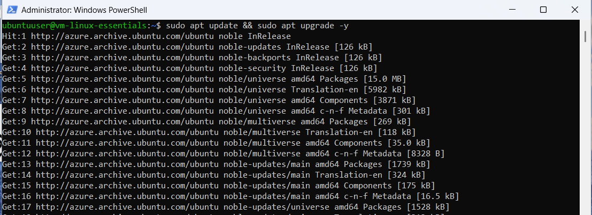

# 01: Linux File System Navigation (LPI 010-160 Topic 1)

## Baseline
Fresh Ubuntu 24.04 LTS deployment.

## Core Navigation

pwd # Print working directory
ls -la # Long listing (permissions, owner)
mkdir ~/linux-essentials # Create directory
cd ~/linux-essentials # Change directory
touch file{1..5}.txt # Create 5 files (brace expansion)
ls -lh # Human-readable sizes
cd ~ # Home directory
pwd # Verify

## Find & Filtering

cd ~/linux-essentials
find . -name "*.txt" # Pattern matching
ls *.txt # Shell wildcard
find . -type f -size +0 -size -10k # Files 0-10kB → Empty (0-byte files)

**Teaching point:** `find` vs shell glob. Size filters work on actual bytes.

## Key Skills Demonstrated
| Command | Purpose | LPI 010-160 |
|---------|---------|-------------|
| `pwd` | Current path | 1.1.1 |
| `ls -la/lh` | List details | 1.1.2 |
| `mkdir`/`cd` | Directory ops | 1.1.3 |
| `touch` | Create files | 1.1.4 |
| `find` | Locate/filter | 1.2.1 |

**Restore:** `baseline-state` snapshot available.
